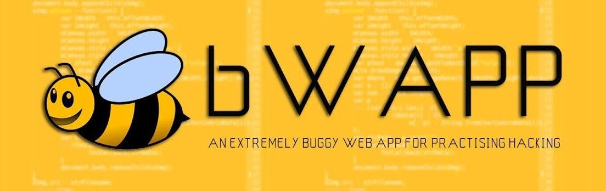
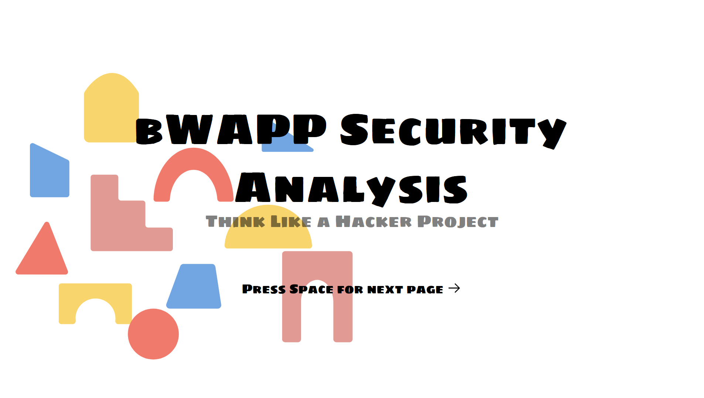

# bWAPP Security Analysis Presentation 🔒

<div align="center">
  
  <br />
  A comprehensive security analysis and presentation of bWAPP (buggy web application).
  <br />
  Part of the "Think Like a Hacker" educational project.
  <br /><br />
  
  
  
  
  
</div>

## 📖 Overview

Interactive presentation exploring bWAPP (buggy web application), focusing on:
- 🔍 Technical architecture analysis
- 💉 Vulnerability demonstrations
- 🛡️ Security best practices
- 🎓 Educational insights

<div align="center">
  
</div>

## 🎯 Key Features

- **Live Demonstrations**: XSS and Directory Traversal attacks
- **Technical Deep Dive**: Docker deployment and security considerations
- **Interactive Content**: Dynamic slides with animations
- **Comprehensive Coverage**: From basics to advanced concepts

## 🚀 Getting Started

### Prerequisites

- Node.js >= 18.0.0
- Docker (for demonstrations)
- Modern web browser

### Docker Setup for Demos

```bash
# Pull and run bWAPP container
docker run -d -p 80:80 raesene/bwapp

# Verify container status
docker ps | grep bwapp
```

### Presentation Setup

```bash
# Clone the repository
git clone https://github.com/yourusername/bwapp-security-slidev.git

# Install dependencies
npm install

# Start the presentation
npm run dev
```

## 🛠️ Built With

- [Slidev](https://sli.dev/) - Presentation framework
- [Vue.js](https://vuejs.org/) - UI components
- [Docker](https://www.docker.com/) - Container platform
- [Markdown](https://www.markdownguide.org/) - Content formatting

## 📝 License

MIT License - see [LICENSE](LICENSE)

## 🙏 Acknowledgments

- OWASP Community
- bWAPP Development Team
- Security Research Community
- Slidev Team

<div align="center">
  <br />
  <p>Made with ❤️ for web security education</p>
  <p>© 2024 alarboulletmarin</p>
</div>
